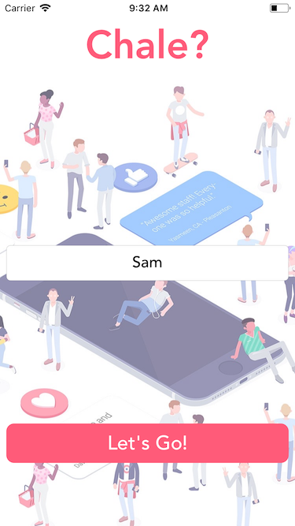
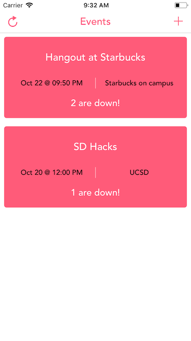
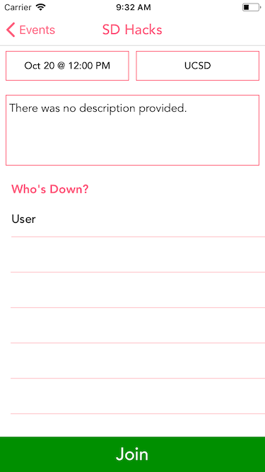
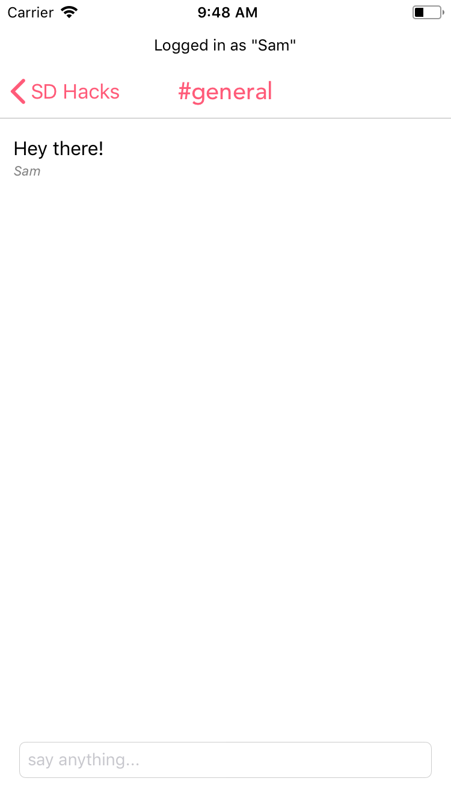

<h1 align="center">Chale? Let's go</h1>

## This is a chat application developed using Twilio's programmable chat SDK. The application solves the issue of communication within a group while making an event plan and reduces many different channels of communication to one.

> The purpose of this application is to join temporary friend group events, chat and plan the event with them, and get rid of the chat after the event ends. We imagine it to be used for hangout events for now, however, this could expand to humanitarian events like fundraisers, donations etc.

## Screenshots

  
  
  
  

